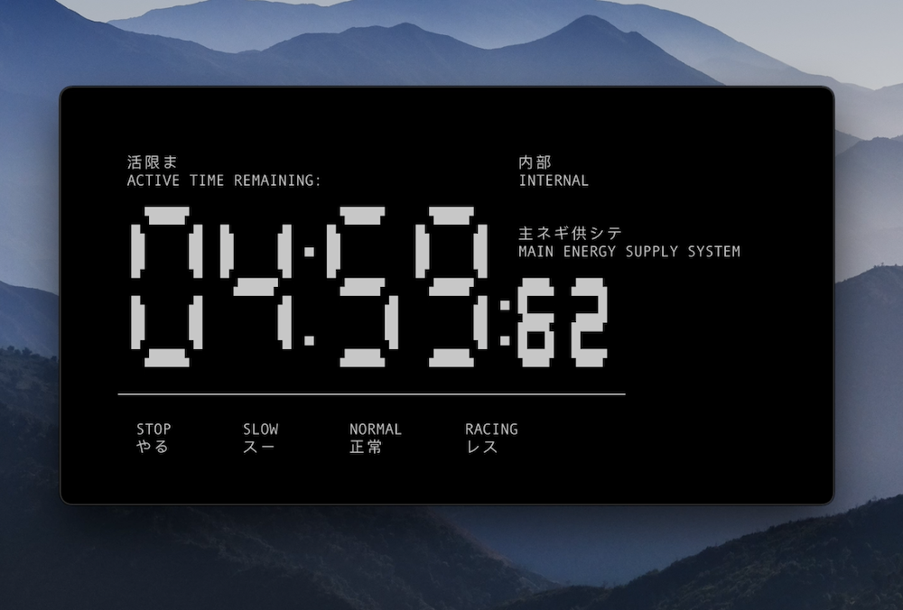

# Neon Genesis Evangelion Power Supply Timer

Command line tool for quickly adding tension to any situation. 



Looks best in [iTerm2](https://iterm2.com/) with 20 rows and 80 columns.


### Build

If you have [go](https://golang.org/doc/install) installed you can build the binary yourself and install with:

```bash
go get github.com/MattSimmons1/eva
```

Alternatively, download the binary from the [releases page](https://github.com/MattSimmons1/eva/releases)
page and save to a location on your PATH.


### Usage

Provide the number of seconds to count down from as the first argument. Defaults to 300. 

```bash
eva 10
```

Show the help message/credits:

```bash
eva help
```

Press `control C` or `control X` to exit.
